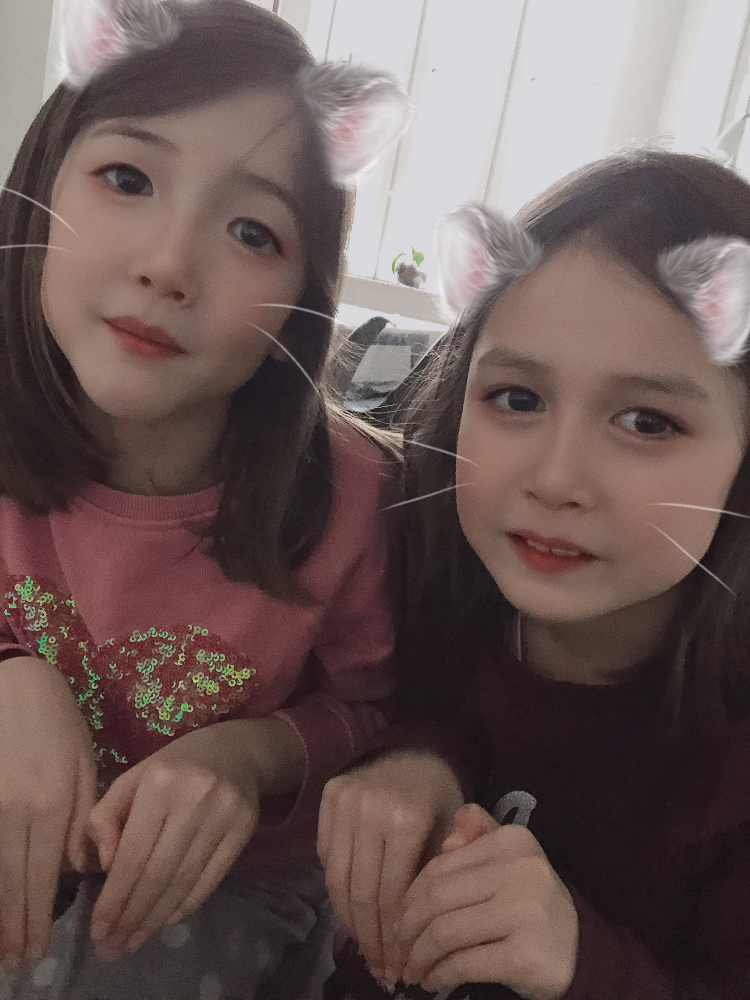

## Welcome Everyone!!

> Her vil jeg over de næste år igennem hele datamatikerstudiet lægge al min kode op. Det bliver spændende at se hvor meget kode det bliver til og at se hvordan mine "coding skills" udvikler sig over årene.

### Lidt om mig:

Jeg er født og opvokset i Sydkorea men jeg har boet i Danmark siden 2013. Jeg er gift og har 2 små piger på 6 år, som lige er startet i skole. Der sker altid meget når man har små børn, så dagene kan være meget travle.
Jeg har altid elsket matematik og logik, og derfor tror jeg at det passer godt til mig med uddannelse som software udvikler. 

Jeg glæder mig til at komme rigtigt igang og ser frem til nogle sjove år her på skolen.

#### Mine piger 

